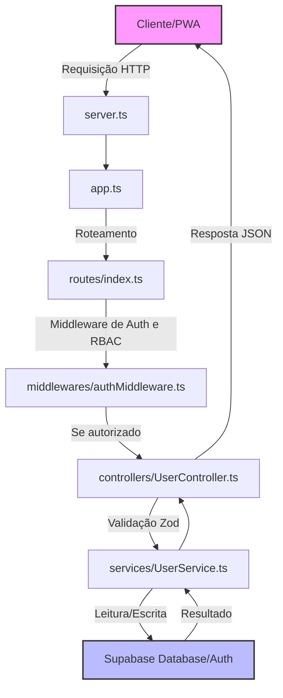

# Guia de Funcionamento - Backend Vida+ (Supabase + Node.js)

Este documento explica a estrutura em camadas adotada no projeto, o fluxo das requisições e a integração com o Supabase.

---

## 📂 Estrutura de Pastas e Arquivos

O projeto segue um padrão em camadas (MVC/Service) para manter o código testável, isolado e de fácil manutenção:

```
VIDA+/
├── server.ts                 # Ponto de entrada (inicia o servidor HTTP)
├── schema.sql                # Estrutura do banco de dados para rodar no Supabase
├── package.json              # Dependências do projeto (Express, Supabase SDK, Zod, etc.)
└── src/
    ├── app.ts                # Configurações do Express, middlewares globais e rotas
    ├── config/
    │   ├── env.ts            # Valida as variáveis do .env usando Zod
    │   └── database.ts       # Inicializa e exporta o cliente do Supabase (Standard e Admin)
    ├── types/
    │   └── index.ts          # Definições de tipos TypeScript globais (usuários, conversas, etc.)
    ├── middlewares/
    │   ├── authMiddleware.ts # Validação de sessão do Supabase (JWT) e controle de acesso (RBAC)
    │   └── errorMiddleware.ts# Captura erros das rotas e retorna formato padrão JSON
    ├── services/
    │   ├── UserService.ts    # Lógica de negócio de usuários, perfis e consentimento LGPD
    │   ├── VolunteerService.ts# Controle de candidaturas, aprovação e status de voluntários
    │   ├── ConversationService.ts # Gestão de filas, início/fim de conversas, envio de mensagens e risco
    │   └── ReportService.ts  # Criação de denúncias e moderação de casos
    ├── controllers/
    │   ├── UserController.ts # Recebe requisições HTTP e valida dados para usuários/autenticação
    │   ├── AdminController.ts# Recebe requisições HTTP para gerência de voluntários e status
    │   ├── ConversationController.ts # Gerencia requisições HTTP das conversas, fila e sinalização
    │   └── ReportController.ts# Gerencia denúncias e respostas de moderação
    └── routes/
        ├── index.ts          # Centralizador de rotas e Health check (/health)
        ├── authRoutes.ts     # Rotas de cadastro, login e logout (/api/auth/*)
        ├── userRoutes.ts     # Rotas de perfil, preferências e LGPD (/api/users/*)
        ├── conversationRoutes.ts # Rotas de chat, filas e sinalização de risco (/api/conversations/*)
        ├── reportRoutes.ts   # Rotas de denúncias de má conduta (/api/reports/*)
        └── adminRoutes.ts    # Rotas de administração de voluntariado (/api/admin/*)
```

---

## 🔄 Fluxo de uma Requisição (Qual arquivo chama qual?)

Quando o Frontend faz uma requisição para o backend, os dados passam pelas seguintes etapas:



### Exemplo Prático: Login do Usuário (`POST /api/auth/login`)
1. **`server.ts`** redireciona a execução para o Express em **`src/app.ts`**.
2. **`src/app.ts`** envia para o roteador central **`src/routes/index.ts`**, que direciona para **`src/routes/authRoutes.ts`**.
3. A rota chama o método `UserController.login` em **`src/controllers/UserController.ts`**.
4. O controller usa o **Zod** para validar o formato de `email` e `password`. Se forem válidos, chama `UserService.login` em **`src/services/UserService.ts`**.
5. O service faz a chamada de login do SDK do Supabase em `supabase.auth.signInWithPassword`.
6. O resultado (tokens da sessão e dados do usuário) volta pela cadeia de chamada e é retornado em formato JSON estruturado com status `200 Success`.

---

## ⚡ Integração com o Supabase

### 1. Autenticação e Autocriação de Perfis
O backend utiliza o Supabase Auth. Criamos um **Trigger SQL** (`on_auth_user_created` em `schema.sql`) no banco de dados. 
Quando o usuário é registrado via `supabase.auth.signUp`:
- O Supabase registra a conta internamente.
- O Trigger copia os dados e insere nas tabelas públicas `users` e `user_profiles`.
- Isso garante que a nossa aplicação possa consultar dados sem violar o isolamento do Supabase Auth.

### 2. Controles de Permissão (Roles)
* O middleware **`requireRoles`** em [authMiddleware.ts](file:///c:/Users/todeb/Desktop/PROJETOS/VIDA+/src/middlewares/authMiddleware.ts) valida se o usuário tem o cargo necessário (`anonimo`, `cadastrado`, `voluntario`, `moderador`, `administrador`) antes de liberar endpoints administrativos.
* O backend usa o `supabaseAdmin` (Service Role Key) para realizar operações que requerem privilégios elevados sem esbarrar nas políticas de RLS.

---

## 🔒 Segurança de Mensagens e LGPD

1. **Mensagens Criptografadas**: As mensagens são criptografadas antes de serem salvas no banco de dados usando as funções `encryptMessage` e `decryptMessage` em [helpers.ts](file:///c:/Users/todeb/Desktop/PROJETOS/VIDA+/src/utils/helpers.ts).
2. **Consentimentos**: Cada ação regulada pela LGPD pode ser registrada no endpoint `/me/consent`, salvando o IP hash, a versão do termo e a data de aceite.
